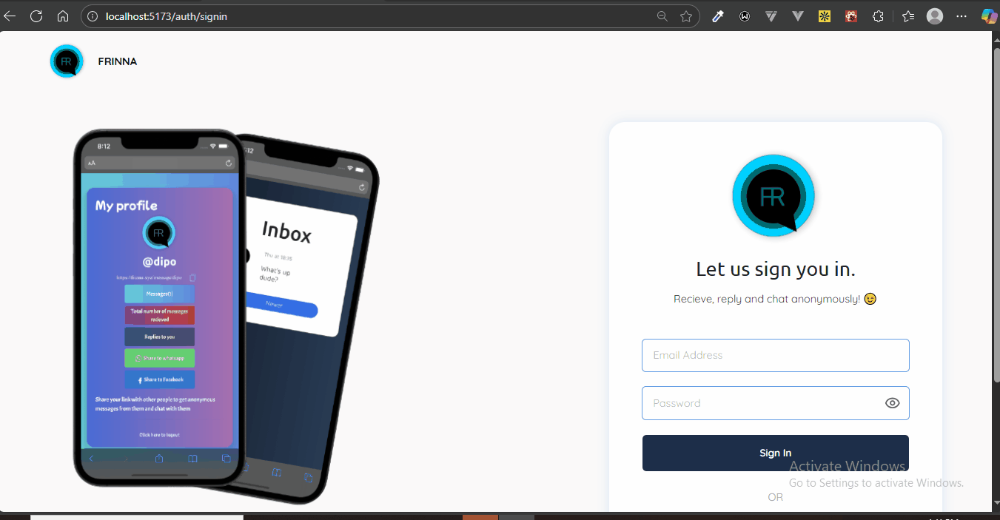
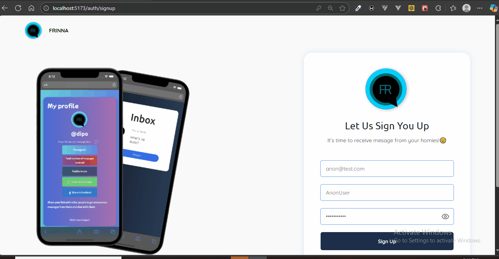
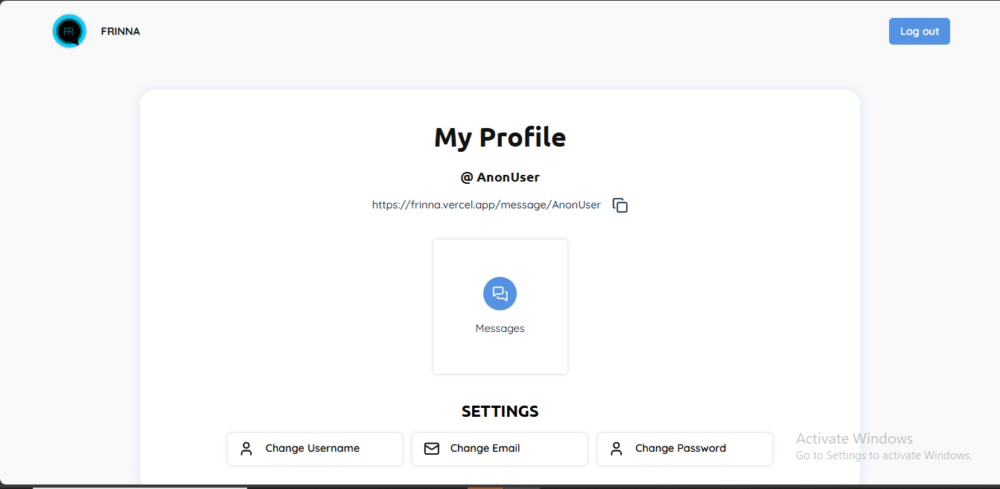

# Frinna - Anonymous Messaging Web Application

Frinna is a full-stack anonymous messaging application built with React and Firebase. As a developer with 3 years of experience in Vue.js, I created this project as a hands-on challenge to master the React ecosystem, from component architecture and state management to automated testing and deployment.

**Live Demo:** [https://frinna.vercel.app]

## 📸 Screenshots


| Sign In Page | Sign Up Page (with validation) | User Dashboard |
| :---: | :---: | :---: |
|  |  |  |

## ✨ Features
- ✅ User Authentication (Email/Password)
- ✅ Anonymous "Mailbox" System for one-way messages
- ✅ Real-time, two-way chat for registered users
- ✅ Message Reply functionality
- ✅ Fully Responsive Design
- ✅ Automated CI/CD pipeline with GitHub Actions

## 🛠️ Tech Stack

This project leverages a modern, professional tech stack:

*   **Framework:** React 19
*   **Build Tool:** Vite
*   **Language:** TypeScript
*   **Styling:** Tailwind CSS
*   **Routing:** React Router DOM v7.7
*   **State Management:** Zustand
*   **Backend & Database:** Firebase (Authentication & Firestore)
*   **Form Handling:** React Hook Form
*   **Notifications:** React Hot Toast
*   **Testing:** Vitest & React Testing Library

## 🤔 Architectural Decisions & Learnings

As a developer transitioning from Vue.js, several key decisions were made to deepen my understanding of the React ecosystem:

1.  **Custom Components over UI Library:** I deliberately chose to build core components like `Button` and `Input` from scratch using Tailwind CSS instead of using a pre-built library. This forced me to master concepts like component polymorphism, `React.forwardRef`, and state management within reusable components.

2.  **Zustand for Global State:** I selected Zustand for its simplicity, minimal boilerplate, and hook-based API. It felt like a natural and modern successor to the patterns I was familiar with from Pinia in the Vue world, making it an excellent tool for managing global authentication state.

3.  **User-Centric Testing with RTL:** I am implementing a test suite using Vitest and React Testing Library to ensure the application is robust and maintainable. This approach focuses on testing the application from the user's perspective, which builds confidence in the app's functionality rather than its implementation details.

## 🚀 Getting Started

To get a local copy up and running, follow these simple steps.

### Prerequisites

*   Node.js (v22)
*   npm or yarn

### Installation

1.  **Clone the repository:**
    ```sh
    git clone https://github.com/devadedeji/frinna.git
    ```
2.  **Navigate to the project directory:**
    ```sh
    cd frinna
    ```
3.  **Install NPM packages:**
    ```sh
    npm install
    ```

### Environment Variables

This project uses Firebase for its backend. You will need to create your own Firebase project to get the necessary credentials.

1.  Create a `.env.local` file in the root of the project.
2.  Add your Firebase configuration variables. You can find these in your Firebase project settings.

    ```env
    # .env.local
    VITE_FIREBASE_API_KEY="your_api_key"
    VITE_FIREBASE_AUTH_DOMAIN="your_auth_domain"
    VITE_FIREBASE_PROJECT_ID="your_project_id"
    VITE_FIREBASE_STORAGE_BUCKET="your_storage_bucket"
    VITE_FIREBASE_MESSAGING_SENDER_ID="your_sender_id"
    VITE_FIREBASE_APP_ID="your_app_id"
    ```

### Running the Application

Start the development server:
```sh
npm run dev
```
Open http://localhost:5173 to view it in the browser.

### Running Tests
To run the component and integration tests, use the following command:
```sh
npm run test
```

